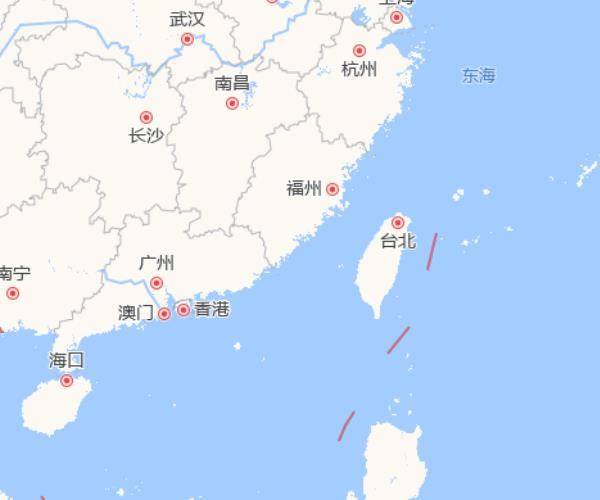
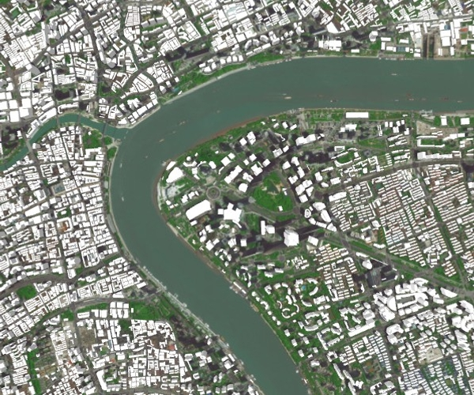

基于three.js开发的GIS框架。

在线demo: http://124.223.202.45/VGIS-Examples/vin3gis


## Display a map

```javascript
const mapViewer = new Vin3GIS.MapViewer({
    target: "map-div",
    imageryTileProivder: new Vin3GIS.AMapImageryTileProvider()
});
```

[](http://124.223.202.45/VGIS-Examples/examples/vin3gis/tilemap/amaptilemap)


## Display 3dtiles

```javascript
const initCameraPosition = new THREE.Vector3(121.506, 31.238, 16500 * 0.7);
const initCameraOrientation = new THREE.Vector3(0, -90,0);
const homeViewPort = new Vin3GIS.ViewPort(
    Vin3GIS.Cartographic.fromDegrees(
        initCameraPosition.x,
        initCameraPosition.y,
        initCameraPosition.z
    ),
    Vin3GIS.Orientation.fromDegreeEulerAngles(initCameraOrientation)
);
const mapViewer = new Vin3GIS.MapViewer({
    target: "map-div",
    imageryTileProivder: new Vin3GIS.AMapImageryTileProvider({
        style: "aerial",
    }),
    homeViewPort: homeViewPort,
    camera: {
        near: 0.001
    }
});
const dracoLoader = new Vin3GIS.DRACOLoader()
dracoLoader.setDecoderPath("http://124.223.202.45/Vin3GIS/v0.0.1/libs/draco/");
const tileset = new Vin3GIS.Earth3DTileset({
    url: 'http://data.mars3d.cn/3dtiles/jzw-shanghai/tileset.json',
    dracoLoader: dracoLoader,
    coordinateOffsetType: Vin3GIS.enums.CoordinateOffsetType.GCJ02,
    customMaterial: (tileset, tile, content) => {
        return new THREE.MeshLambertMaterial({
            color: new THREE.Color('#aaa'),
            depthTest: true,
            transparent: false,
            depthWrite: true,
            side: THREE.DoubleSide
        });
    }
});
tileset.adjustHeight(71);
mapViewer.scene.primitives.add(tileset);
```

[](http://124.223.202.45/VGIS-Examples/examples/vin3gis/models/3dtileswhitemodel)

## Install

+ NPM
```sh
npm install vin3gis --save
```

+ CDN
```html
<!-- three.js -->
<script src="https://unpkg.com/three@0.146.0/build/three.min.js"></script>
<!-- Vin3GIS.min.js -->
<script src="https://unpkg.com/vin3gis/dist/Vin3GIS.min.js"></script>
```